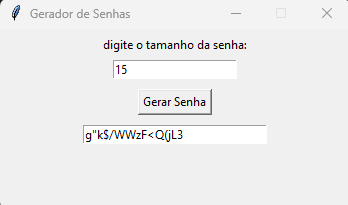

# 🔐 Gerador de Senhas com Interface Gráfica

Esse é um projetinho simples que criei pra treinar Python e brincar com interface gráfica. A ideia é gerar senhas seguras de forma rápida e prática, usando a biblioteca `tkinter`, que já vem com o Python.

---

## 📌 O que esse projeto faz?

- Gera senhas aleatórias misturando letras (maiúsculas e minúsculas), números e símbolos especiais (exceto vírgula).
- Permite que o usuário escolha o tamanho da senha.
- Interface gráfica leve e fácil de usar.
- Não precisa instalar bibliotecas externas.


---

## 🖼️ Visual do app

> Interface simples e direta:
- Campo pra digitar o tamanho da senha
- Botão pra gerar
- Senha aparece logo abaixo


Veja como a interface do gerador de senhas ficou:



---
## ▶️ Como rodar o projeto

### Pré-requisitos

Você só precisa ter o Python instalado. O `tkinter` já vem junto na maioria das instalações.

### Passos:

1. Clone o repositório:
```bash
git clone https://github.com/seu-usuario/gerador-senha-grafico.git
cd gerador-senha-grafico

```

2. Rode o script:
```bash
python senha_gui.py
```

## 💭 Por que eu fiz isso?
Eu tô começando a montar meus repositórios no GitHub e queria algo útil e fácil de mostrar. Aproveitei pra treinar um pouco de Python com interface gráfica, que é algo que acho legal e pode ser usado em projetos maiores depois.

## 📬 Sugestões e melhorias
Se quiser contribuir, dar ideias ou achar algum errinho, fica à vontade pra abrir uma issue ou mandar um pull request! 😄

Feito com 💻 e ☕ por Gabriel Gomes De Albuquerque Silva


---

